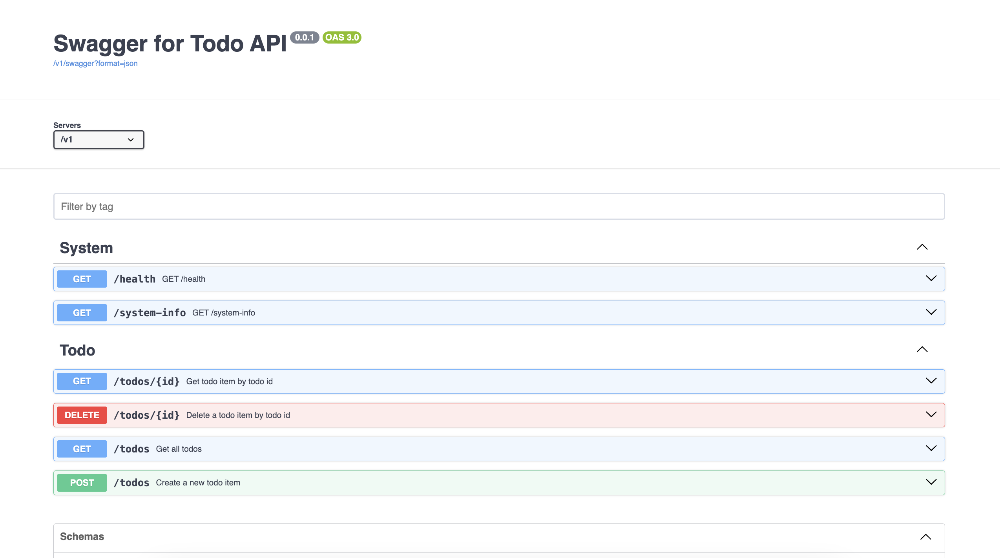
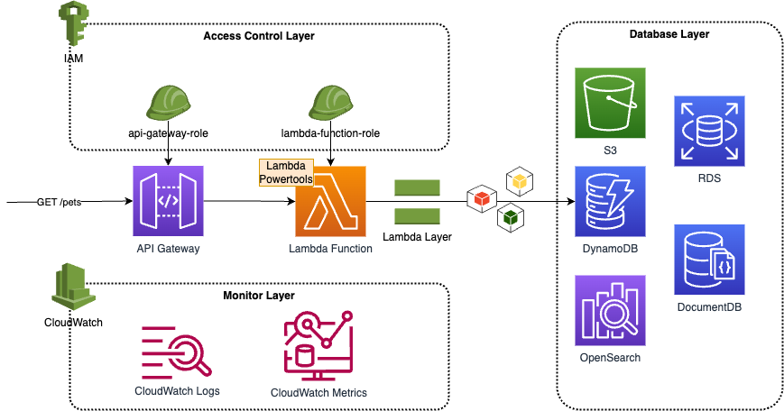

# A REST API (Serverless) in AWS using Terraform

[](https://github.com/camillehe1992/scaffolding-serverless-project-on-aws/blob/main/LICENSE)
[](https://www.python.org/downloads/release/python-310/)
[](https://github.com/camillehe1992/scaffolding-serverless-project-on-aws/releases/tag/v0.1.2)

The project is an AWS cloud native serverless application, including API Gateway, Lambda function (with layers), and Dynamodb for data persistence. However, AWS provides a variety of storage services and you should make the decisition as you needs.

The project is powered by [Powertools for AWS Lambda (Python)](https://docs.powertools.aws.dev/lambda/python/latest/), which is a developer toolkit to implement Serverless best practices and increase developer velocity. With it, we enabled the [SwaggerUI](https://docs.powertools.aws.dev/lambda/python/latest/core/event_handler/api_gateway/#enabling-swaggerui) for the project, you can view the detailed backend API from `API Gateway Invoke URL + /swagger`. The swagger UI shows as below.



The diagram below shows the archtecture details. All AWS resources are built and deployed using Terraform.



## Project Structure

```bash
# tree -La 2
.
├── .coveragerc                 # configuration file for python test coverage
├── .editorconfig               # configuration for editor code style and format
├── .env.sample                 # environment variables for local development and deployment
├── .github
│   └── workflows               # github action workflows
├── .gitignore
├── .pre-commit-config.yaml     # configuration for pre-commit, such as lint, auto format, test
├── .pylintrc                    # configuration for pylint
├── .pytest.ini                  # configuration for pytest
├── .pylintrc
├── Makefile                    # makefile to simplify your local deployment using shell scripts
├── README.md
├── cloudformation              # terraform backend resources CFT
│   └── infra.yaml
├── docs                        # documentation
├── requirements-dev.txt        # thirt-party dependencies for development
├── scripts                     # shell scripts for Jenkins pipelines
├── src
│   ├── __init__.py
│   ├── local_test              # Lambda function test script for local development
│   ├── portal                  # Lambda function portal source code
│   └── tests                   # Lambda source code test, such as unit test, e2e test, etc
└── terraform                   # terraform components and modules definition
    ├── deployment
    ├── modules
    └── settings
```

## Development

Follow [DEVELOPMENT.md](./docs/DEVELOPMENT.md) when you want to setup a development environment on your local machine.

## Deployment

Follow [DEPLOYMENT.md](./docs/DEPLOYMENT.md) to deploy project from local machine or via CICD pipelines.

## References

- [Terraform AWS Provider](https://registry.terraform.io/providers/hashicorp/aws/latest)
- [AWS Lambda Powertools for Python](https://docs.powertools.aws.dev/lambda/python/latest/)
