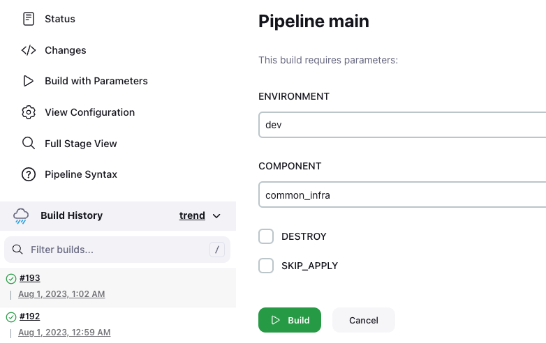
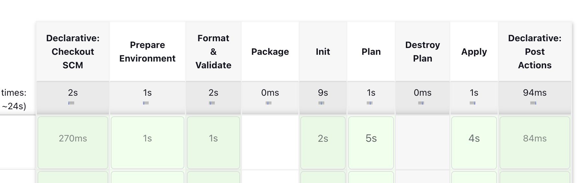
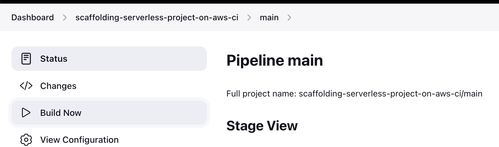
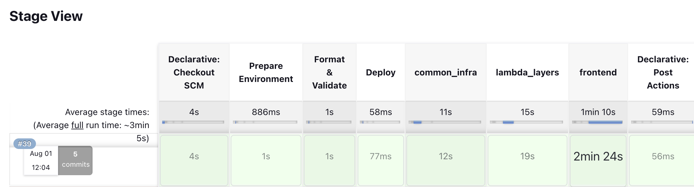

# Deployment Documenatation

We provides two ways to deploy the project into target AWS environment: manually and automatically.

## Manual Deployment from local

Follow [DEVELOPMENT.md](DEVELOPMENT.md) to setup your local environment if you want to deploy from local.

Create a `.env` from `env.sample`, and update environment variables as needed. The `.env` file won't be checked into your source code. After updated, these variables in `.env` will be injected into `Makefile` when you execute `make` commands. You can run `make pre-check` to validate these variables.

After done, run below `make` commands to deploy terraform resources to target AWS environment from local.

```bash
make plan
make apply
```

Run below `make` commands to destroy/remove terraform resources from target AWS environment from local.

```bash
make plan-destroy
make apply
```

## Automate Deployment via GitHub Actions

todo

## Automate Deployment via Jenkins

[Jenkins](https://www.jenkins.io/doc/) is a self-contained, open source automation server which can be used to automate all sorts of tasks related to building, testing, and delivering or deploying software.

In the project, we use `Jenkins` as our CICD tool. We have two Jenkinsfiles in the project root directory. Create pipelines in Jenkins using these files.

`Jenkinsfile` is used to deploy/destroy a specific component that you can choose by `Build with Parameters`.

`Jenkinsfile.ci` is used to deploy all components.

In order to deploy AWS resoources to AWS environment, you must setup AWS credentials in Jenkins -> Credentials -> System -> Global credentials -> Add Credentials.

- Kind: AWS Credentials
- Scope: Global
- ID: An internal unique ID by which these credentials are identified from jobs and other configuration
- Description: An optional description to help tell similar credentials apart
- Access Key ID and Secret Access Key: The AWS credentials for deployment

After created, you can use the credentials in your pipeline. In Jenkinsfile, leverage [Pipeline: AWS Step](https://www.jenkins.io/doc/pipeline/steps/pipeline-aws/) `withAWS` step to

I define an environment variable named `CREDENTIALS` and the value should be the `ID` you provided in the Credentials. Then, execute scripts in block `withAWS`.

The pipeline executes terraform scripts in container, which provide Terraform execution environment and providers pre-installed. The docker image is located in AWS ECR. You can use the official [image from Hashicorp](https://hub.docker.com/r/hashicorp/terraform/), but sometimes it’s wise to maintain your own Docker images with additional tools you may need. If you decided to use the official image, skip `ecr_login.sh` and replace environment variable `TF_IMAGE` with `hashicorp/terraform`.

### Deploy/Destroy a specific Component

 `Jenkinsfile` is used to deploy/destroy a specific component that you can choose by `Build with Parameters`.

- Choose `ENVIRONMENT` and `COMPONENT` to deploy.
- Check the `DESTROY` if this is a destroy action. Deploy as a default.
- Check `SKIP_APPLY` if you don't want to create AWS resources. Useful when you only focus on the changes.



A view of pipeline stages.



### Deploy all Components

`Jenkinsfile.ci` is used to deploy all components.



A view of pipeline stages.


